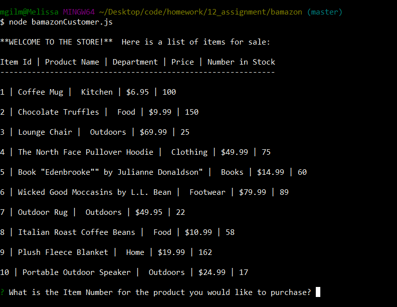
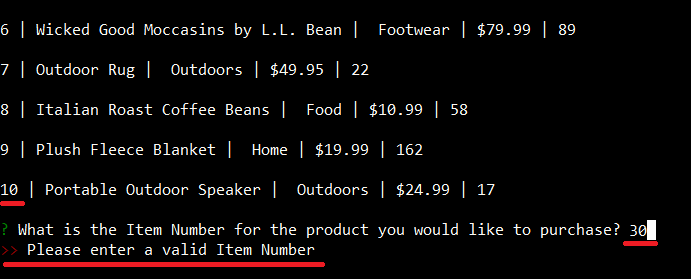
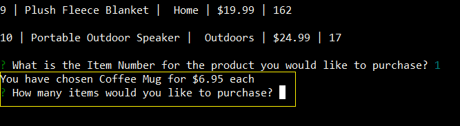
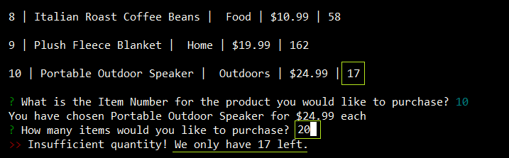
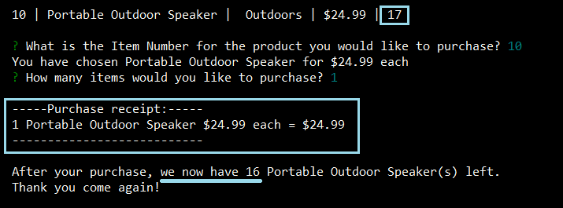
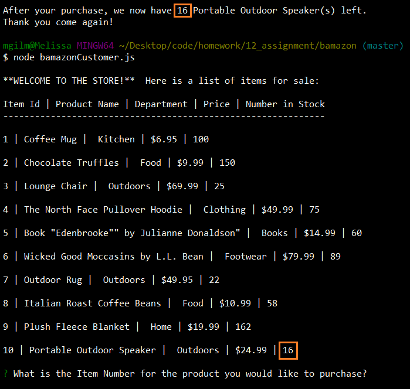

# Bamazon
An Amazon-like storefront to showcase MySQL skills

## Overview

I have created an Amazon-like storefront to showcase MySQL skills.
The app takes in orders from customers and depletes the stock from the store's inventory. 
The app uses Inquirer to prompt the customer as to how they wish to proceed.

## NPM Packages Used
1. MySQL
2. Inquirer

## Workflow
1. The customer will enter the store by typing `node bamazonCustomer.js` in the console. 
Customer is then presented with the store's inventory and asked which product they wish to purchase.

2. The customer enters the product number for the preferred product. The customer must input a valid Item Number 

3. Upon entering a valid item number, the store will let them know which item they have chosen and the price for the item. 
The store will also ask them how many of the items they wish to purchase.

4. The customer enters the quantity of the product they wish to purchase. They cannot purchase more than the store has in stock.

5. Upon entering a valid quantity, the customer is presented with their Purchase Receipt detailing the total sum of their purchae. 
The customer is also informed of the remaining quantity of that item and the transaction is complete.

5. The next time a customer enters the store, they will be presented with an updated inventory.

